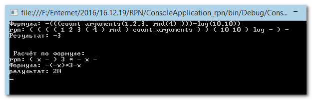

# RPN - Обратная польская нотация

This is a simple library that can convert string in Func using RPN.

```csharp
   Func<double, double> func = Expression.ToDelegate("-log(x,2)*sin(x)");
```
and func - representation of the "-log(x,2)*sin(x)" as function of x.

```csharp
class Program {
        [STAThread]
        static void Main( string[] args ) {
            //Expression rpn = Expression.ToPolishNotation(Expression.ToExpresion("log(12)+123+rotate(1,2,3,9-1)"));
            //Expression rpn = Expression.ToPolishNotation(Expression.ToExpresion("rotate(rnd(),1,2,3)+log(12, rnd(4,5,6) )"));
            //Expression rpn = Expression.ToPolishNotation(Expression.ToExpresion("rotate(rnd(),2,3,4)+rotate(11)+log(10,11,12)+sin(0.5)"));
            string str_formula = "-(((count_arguments(1,2,3, rnd(4) )))-log(10,10))";
            //str_formula = "((rnd(1,2,3,4)))";
            //str_formula = "-(-5)";
            try {
                Console.WriteLine("Формула: " + str_formula);
                Expression rpn = Expression.ToPolishNotation(Expression.ToExpresion(str_formula));
                Console.WriteLine("rpn: " + rpn.ToString());
                Console.WriteLine("Результат: " + Expression.Calculate(rpn));
                Console.WriteLine("\n\n Расчёт по формуле:");
                // Проверка формулы как функции:
                str_formula = "-(-x)*3-x";
                rpn = Expression.ToPolishNotation(Expression.ToExpresion(str_formula));
                Console.WriteLine("rpn: " + rpn.ToString());
                Func<double, double> func = Expression.ToDelegate(str_formula);
                double res = func(10);
                Console.WriteLine("Формула: " + str_formula);
                Console.WriteLine("результат: "+res);
            }catch(Exception _ex) {
                Console.WriteLine(str_formula);
                string ex_info = Utilities.getExceptionInfo(_ex);
                //Clipboard.SetText(ex_info);
                Console.WriteLine(ex_info); // _ex.Message);

            }
            Console.ReadKey();
        }
    }
```

Результат:



Пришлось оставить скобки в стеке обратной польской нотации, т.к. без них нельзя было считать функции с переменным числом аргументов.